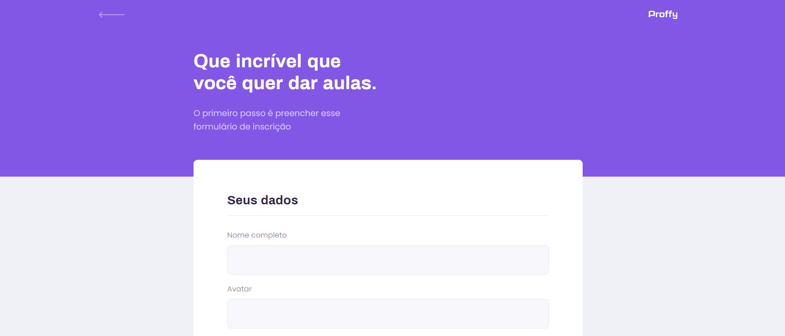
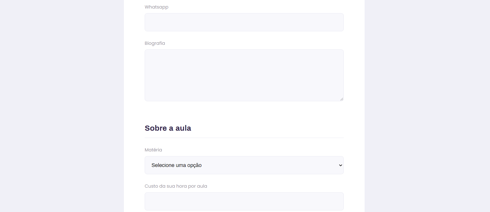

# Proffy

Aplicação que une proffys e alunos

### ReactJS, Typescript
### API construída em nodeJS

----------------------------------------------------

----------------------------------------------------

## Instalação | Execução

Clone esse repositório rodando:

    git clone https://github.com/MarthinKorb/ProffyWeb.git

----------------------------------------------------

Abra o terminal na pasta do projeto e instale as dependências rodando o comando:

    yarn

Agora vamos iniciar nosso front-end:

    yarn start

____________________________________________________
Após, você pode clonar o repositório da API:

     git clone https://github.com/MarthinKorb/ProffyServer.git

**Feito!** ✔

Agora é só buscar Proffys ou se cadastrar e se tornar um Proffy!

----------------------------------------------------

